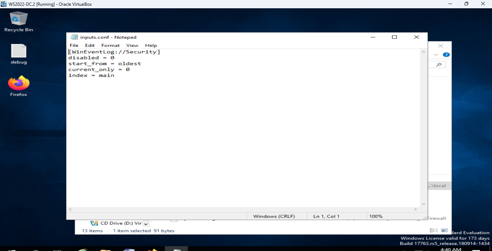

# Lab 1: Splunk Data Ingestion & Configuration

## Objective
To establish a functional pipeline between a Windows Server and Splunk Enterprise to enable security auditing.

## Process
1. **Service Validation**: Confirmed the `splunkd` service was active via Windows Services (`services.msc`).
2. **Configuration Override**: Manually defined log ingestion paths by creating a local `inputs.conf` file.

## Technical Commands & Configuration
- **Configuration Path**: `C:\Program Files\Splunk\etc\system\local\`
- **inputs.conf Content**:
```ini
[WinEventLog://Security]
disabled = 0
start_from = oldest
current_only = 0
index = main

